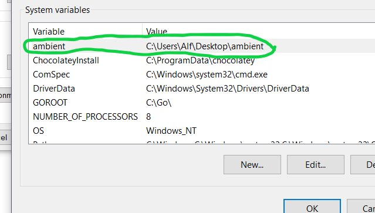
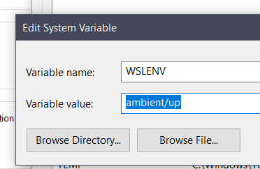

# Windows Subsystem for Linux (WSL)

Most of my config files will reside here.
There's a lot of symlink black magic going on in this directory.
For instance, `/root/.bashrc` links to `$ambient/wsl/root.bashrc`.

Where is `$ambient` set?

Well that's set on the Windows side like this:

You might notice that it's a Windows path.
Also, there's still the issue of getting that variable into WSL.
For that, I use the magical `WSLENV` variable!

That `/up` tells Windows to translate the path to `/mnt/c/Users/Alf/Desktop/ambient`.

## Is it cursed?

<h1>Y E S</h1>
